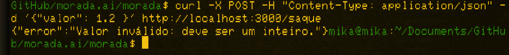

# Morada.ai
 Projeto criado para o processo seletivo de estágio para a morada.ai

 # Log de commits

 - 22/10/2025 - Início do projeto com levantamento de requisitos do cliente morada.ai
 - 22/10/2025 - Commit inicial contendo as funcionalidades não testadas
 - 23/10/2025 - Commit após teste dos endpoints, com resposta.
 - 23/10/2025 - Testes unitários 

 # Principais desafios e aprendizados

 Dentre os principais desafios encontrados por mim durante o projeto posso citar a utilização do Jest para realização de testes unitários, ferramenta essa na qual ainda não possuía total conhecimento sobre, porém a documentação, encontrada em: https://jestjs.io/, ao ser consultada, foi capaz de fornecer respostas para todas as principais dúvidas. 

 # Execução do projeto 

 - Pré requisitos
   - Node.js
   - Nest.js
   - 
 - Guia:
 
   Acessa o diretório do projeto
   ```
   cd morada
   ```
   Instala dependências do projeto
   ```
   npm install
   ```
   Roda projeto em modo desenvolvedor
   ```
   npm run start:dev
   ```

   Roda testes por meio do Jest 
   ```
   npx jest --runInBand
   ```
   Comando CURL para respostas do Json
   ```
   curl -X POST -H "Content-Type: application/json" -d '{"valor": 2077 }' http://localhost:3000/saque
   ```

   


   # Testes
   
  Testes Jest
  
  
  Teste com um valor inteiro positivo
  
  
  Teste com String
  

  Teste com valor não inteiro
  
  
  Teste com valor inteiro negativo
    

  
  


   
 
